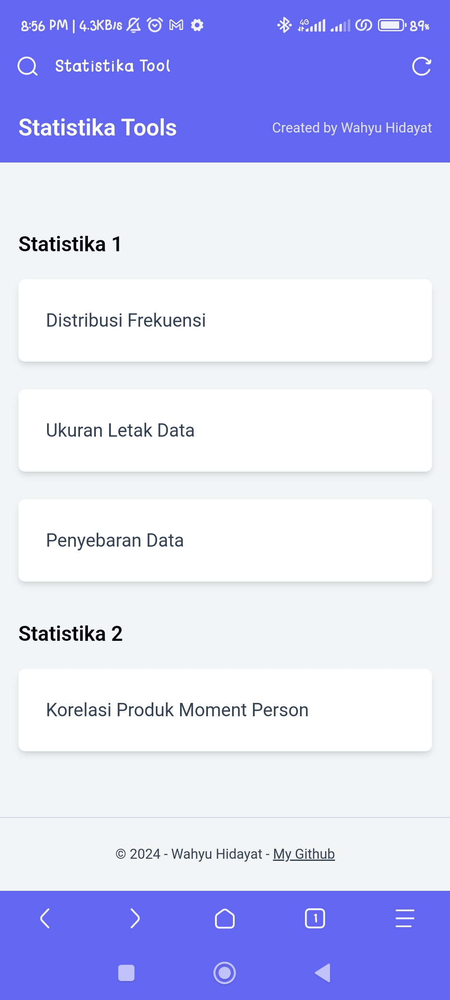
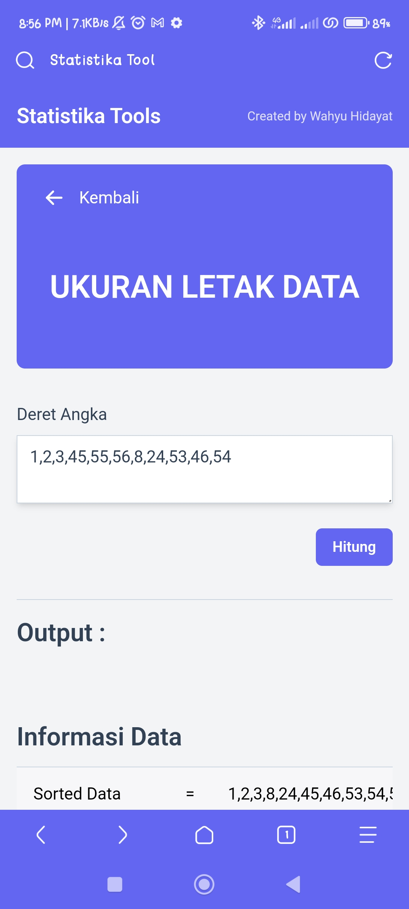

# Statistika Tools

Ini adalah sebuah tools untuk menghitung soal statistika, sengaja saya buat karena saya tidak pintar menghitung jadi ketika UAS atau UTS tinggal pake tools ini dan sat set sat set jadi.

Tools ini berbasis WEB dibuat menggunakan bahasa pemerograman PHP, jika ingin cloning langsung clone saja, tidak ada login-loginan dan tidak pake database databasean.

## Menu yang tersedia saat ini

1. Distribusi Frekuensi
2. Ukuran Letak Data
3. Penyebaran Data
4. Korelasi Produk Moment Person

Seiring dengan materi yang diajarkan kepada saya, maka tools ini akan diupdate berkala (InsyaAllah).

## Gambaran Aplikasi / Screenshot

1. Tampilan Desktop

2. Tampilan Mobile (jika dibuka di HP)

